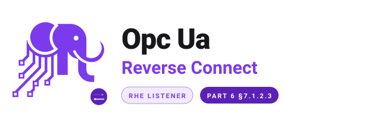

<h1 align="center"><strong>OPC UA Reverse Connect — PHP listener</strong></h1>

<div align="center">
  <picture>
    <source media="(prefers-color-scheme: dark)" srcset="assets/logo-dark.svg">
    <source media="(prefers-color-scheme: light)" srcset="assets/logo-light.svg">
    
  </picture>
</div>

<p align="center">
  <a href="https://github.com/php-opcua/opcua-client-ext-reverse-connect/actions/workflows/tests.yml"></a>
  <a href="https://packagist.org/packages/php-opcua/opcua-client-ext-reverse-connect"></a>
  <a href="https://packagist.org/packages/php-opcua/opcua-client-ext-reverse-connect"></a>
  <a href="LICENSE"></a>
</p>

<p align="center">
  
  
  
</p>

---

Client-side listener for **OPC UA Reverse Connect** ([Part 6 §7.1.2.3](https://reference.opcfoundation.org/Core/Part6/v105/docs/7.1.2.3)). Extension of [`php-opcua/opcua-client`](https://github.com/php-opcua/opcua-client). The server dials out, the client accepts; everything after the opening `ReverseHello` frame is the standard UA-TCP protocol.

Reverse Connect inverts who initiates the underlying TCP connection. It is the pattern of choice when the server is behind NAT or a one-way firewall: the device dials outward, your PHP application listens for the incoming socket, validates the announced `ServerUri`, then proceeds with the normal UA-TCP handshake — secure channel, session, service calls — exactly as if you had connected the regular way.

**What you can do with it:**

- **Bind a listener** on any host/port and accept inbound `RHE` frames from one or many announcing servers
- **Validate** each frame against an explicit whitelist of trusted `ServerUri` values before letting the UA-TCP pipeline touch the socket
- **Hand the live socket** to the standard `ClientBuilder` via the v4.4.0 `TcpTransport::fromConnectedSocket()` seam, then use the resulting `Client` like any other
- **Observe** the flow with three PSR-14 events — `ReverseHelloReceived`, `ReverseConnectAccepted`, `ReverseConnectRejected` — and a PSR-3 logger
- **Cover failure modes explicitly** with four typed exceptions (parse, validation, timeout, plumbing) rooted in a single base class

Pure PHP, no native extensions, no event loop dependency.

> **Note:** This package only ships the listener-side machinery. The OPC UA server you talk to must support Reverse Connect on its end and be told (via configuration, MQTT, an HTTPS callback — whatever fits your topology) to dial back to the listener's host and port. For integration testing the [`uanetstandard-test-suite`](https://github.com/php-opcua/uanetstandard-test-suite) v1.4.0+ exposes two Method nodes — `StartReverseConnect` and `StopReverseConnect` — that let a regular client trigger the outbound dial.

<table>
<tr>
<td>

### How it relates to `opcua-client`

The only seam in the core package is the `TcpTransport::fromConnectedSocket()` factory (added in v4.4.0) and the matching `ManagesConnectionTrait::performConnect()` skip when the transport is already connected. Everything else — the listener, the parser, the whitelist validator, the bridge to `ClientBuilder` — lives here. Applications that do not need Reverse Connect take no extra dependency.

</td>
</tr>
</table>

----

## Quick Start

```bash
composer require php-opcua/opcua-client-ext-reverse-connect
```

```php
use PhpOpcua\Client\ClientBuilder;
use PhpOpcua\Client\ExtReverseConnect\ReverseConnectClientFactory;
use PhpOpcua\Client\ExtReverseConnect\ReverseConnectListener;
use PhpOpcua\Client\ExtReverseConnect\ReverseHelloValidator;
use PhpOpcua\Client\Security\SecurityMode;
use PhpOpcua\Client\Security\SecurityPolicy;

$listener = new ReverseConnectListener(
    bindHost: '0.0.0.0',
    bindPort: 4841,
    validator: new ReverseHelloValidator(['urn:my-edge-gateway:server']),
);
$listener->listen();

$session = $listener->accept(timeoutSeconds: 30.0);

$client = (new ReverseConnectClientFactory())->buildClient(
    $session,
    static fn (ClientBuilder $b) => $b
        ->setSecurityPolicy(SecurityPolicy::None)
        ->setSecurityMode(SecurityMode::None),
);

$value = $client->read('ns=2;s=Demo.Counter');
echo $value->getValue() . PHP_EOL;

$client->disconnect();
$listener->close();
```

That's it. Bind, accept, build, use, disconnect — five calls and you are reading values through a socket the server opened.

## See It in Action

### Validate against a whitelist

```php
use PhpOpcua\Client\ExtReverseConnect\ReverseHelloValidator;

$validator = new ReverseHelloValidator([
    'urn:gateway:plc-42',
    'urn:gateway:plc-43',
]);

// The listener uses ensureAccepted() internally; you can call it
// yourself on captured frames in tests or audit pipelines.
$validator->ensureAccepted($message);   // throws ReverseConnectRejectedException
$validator->isAccepted($message);       // bool — non-throwing variant
```

An empty whitelist refuses every incoming frame — the validator is **fail-secure by default**.

### React to events (PSR-14)

```php
use PhpOpcua\Client\ExtReverseConnect\Event\ReverseConnectAccepted;
use PhpOpcua\Client\ExtReverseConnect\Event\ReverseConnectRejected;
use PhpOpcua\Client\ExtReverseConnect\Event\ReverseHelloReceived;

$listener = new ReverseConnectListener(
    bindHost: '0.0.0.0',
    bindPort: 4841,
    validator: $validator,
    dispatcher: $yourPsr14Dispatcher,
);

// Listeners observe parseable RHEs, accepted sessions, and rejections.
class AuditHandler {
    public function onReceived(ReverseHelloReceived $event): void { /* ... */ }
    public function onAccepted(ReverseConnectAccepted $event): void { /* ... */ }
    public function onRejected(ReverseConnectRejected $event): void {
        Log::warning("Rejected {$event->message->serverUri}: {$event->reason}");
    }
}
```

Zero overhead when no dispatcher is provided — events are not constructed at all.

### Trigger the server from PHP (test suite flow)

```php
use PhpOpcua\Client\Types\BuiltinType;
use PhpOpcua\Client\Types\NodeId;
use PhpOpcua\Client\Types\Variant;

$trigger = (new ClientBuilder())
    ->setSecurityPolicy(SecurityPolicy::None)
    ->setSecurityMode(SecurityMode::None)
    ->connect('opc.tcp://localhost:4840/UA/TestServer');

$trigger->call(
    NodeId::string(2, 'TestServer/ReverseConnect'),
    NodeId::string(2, 'TestServer/ReverseConnect/StartReverseConnect'),
    [
        new Variant(BuiltinType::String, 'host.docker.internal'),
        new Variant(BuiltinType::UInt16, $listenerPort),
    ],
);
```

In production the trigger is whatever you already have — HTTPS callback, MQTT push, a CLI on the gateway. The listener does not care how the server learned where to dial.

### Connect with full security

```php
$client = (new ReverseConnectClientFactory())->buildClient(
    $session,
    static fn (ClientBuilder $b) => $b
        ->setSecurityPolicy(SecurityPolicy::Basic256Sha256)
        ->setSecurityMode(SecurityMode::SignAndEncrypt)
        ->setClientCertificate('/certs/client.pem', '/certs/client.key', '/certs/ca.pem')
        ->setUserCredentials('operator', 'secret'),
);
```

Reverse Connect inverts the TCP direction; it does **not** change the OPC UA security model. Configure the builder inside the `$configure` closure the same way you would for a classic outbound client. Do not call `setTransport()` inside the closure — the factory has already wired one from the inherited socket.

### Run the loop

```php
while ($keepRunning) {
    try {
        $session = $listener->accept(timeoutSeconds: 5.0);
    } catch (ReverseConnectTimeoutException) {
        continue;
    } catch (ReverseConnectRejectedException $e) {
        Log::warning("Rejected reverse-connect from {$e->rejectedMessage->serverUri}: {$e->getMessage()}");
        continue;
    } catch (ReverseHelloParseException $e) {
        Log::warning("Malformed RHE: {$e->getMessage()}");
        continue;
    }

    handleSession($session);
}
$listener->close();
```

## Why This Package?

- **Tiny, focused surface** — six classes, four exceptions, three events. Everything else is `php-opcua/opcua-client`.
- **No event loop dependency** — bounded `accept(timeoutSeconds)` over `stream_select()`. Plug into your own loop or run a CLI worker.
- **Fail-secure validator** — empty whitelist refuses every frame; case-sensitive `ServerUri` match; `opc.tcp://` scheme enforced on the announced endpoint.
- **PSR everywhere** — PSR-3 logger and PSR-14 dispatcher both optional. No global state. No service locator.
- **Cross-platform** — pure PHP streams API; no Unix domain sockets, no FFI, no native extensions. Tested on Linux, macOS, and Windows.
- **Reuses the full core** — same `Client`, same security stack, same modules, same DTOs as `opcua-client`. The transport seam is `TcpTransport::fromConnectedSocket()`; the rest of the pipeline is untouched.
- **Thoroughly tested** — 44 unit tests + 4 end-to-end integration tests against UA-.NETStandard via [`uanetstandard-test-suite`](https://github.com/php-opcua/uanetstandard-test-suite) v1.4.0+.

## Documentation

The published version of the documentation lives at <https://www.php-opcua.com/dev/components>. The Markdown sources ship under [`docs/`](docs/index.md):

| Section | Covers |
|---------|--------|
| **Getting started** — [Overview](docs/overview.md) · [Installation](docs/getting-started/installation.md) · [Quick start](docs/getting-started/quick-start.md) | What it is, how to install, first listener |
| **Concepts** — [How Reverse Connect works](docs/concepts/how-it-works.md) | Wire format, lifecycle, security model |
| **API** — [Listener](docs/api/listener.md) · [Validator](docs/api/validator.md) · [Factory](docs/api/factory.md) · [Events](docs/api/events.md) | Constructor arguments, methods, rejection rules |
| **Recipes** — [Docker host networking](docs/recipes/docker-host-networking.md) | `extra_hosts` + `0.0.0.0` bind pattern |
| **Reference** — [Exceptions](docs/reference/exceptions.md) | Every exception, cause, and catch strategy |

## Testing

```bash
./vendor/bin/pest                                          # everything
./vendor/bin/pest tests/Unit/                              # unit only (44 tests, no external deps)
./vendor/bin/pest tests/Integration/ --group=integration   # E2E (requires uanetstandard-test-suite v1.4.0+)
```

The integration suite expects the `opcua-no-security` service from `uanetstandard-test-suite` running on `opc.tcp://localhost:4840` with `extra_hosts: ["host.docker.internal:host-gateway"]` configured (already the case in v1.4.0+).

## Ecosystem

| Package | Description |
|---------|-------------|
| [opcua-client](https://github.com/php-opcua/opcua-client) | Pure PHP OPC UA client (the core this extension hooks into) |
| [opcua-client-ext-pubsub](https://github.com/php-opcua/opcua-client-ext-pubsub) | OPC UA PubSub Subscriber — UDP + UADP + JSON |
| [opcua-cli](https://github.com/php-opcua/opcua-cli) | CLI tool — browse, read, write, watch, discover endpoints, manage certificates |
| [opcua-client-nodeset](https://github.com/php-opcua/opcua-client-nodeset) | Pre-generated PHP types from 51 OPC Foundation companion specifications |
| [laravel-opcua](https://github.com/php-opcua/laravel-opcua) | Laravel integration — service provider, facade, config |
| [uanetstandard-test-suite](https://github.com/php-opcua/uanetstandard-test-suite) | Docker-based OPC UA test servers (UA-.NETStandard) for integration testing |

## Community

Have questions, ideas, or want to share what you've built? Join the [GitHub Discussions](https://github.com/php-opcua/opcua-client/discussions).

## Contributing

Contributions welcome — see [CONTRIBUTING.md](CONTRIBUTING.md) in the core repository for the shared code style and workflow.

## Changelog

See [CHANGELOG.md](CHANGELOG.md).

## License

[MIT](LICENSE)
